# FinCorp — Immutable & Indestructible Pipeline

> Secure, auditable software supply chain for FinCorp built on AWS — immutable container artifacts with a zero-tolerance CVE gate, and a fully automated cross-region disaster recovery system for PostgreSQL.

---

## Table of Contents

- [Overview](#overview)
- [Architecture](#architecture)
  - [Workstream A — Immutable Artifact Pipeline](#workstream-a--immutable-artifact-pipeline)
  - [Workstream B — Cross-Region Disaster Recovery](#workstream-b--cross-region-disaster-recovery)
- [Repository Structure](#repository-structure)
- [Prerequisites](#prerequisites)
- [Setup](#setup)
- [Workstream A — How It Works](#workstream-a--how-it-works)
- [Workstream B — How It Works](#workstream-b--how-it-works)
- [Security Design](#security-design)

---

## Overview

This project implements two independent security-focused workstreams for FinCorp's infrastructure:

| Workstream | Description | Region |
|---|---|---|
| **A — Artifact Pipeline** | GitHub Actions → CodeArtifact pip proxy → ECR (IMMUTABLE + scan) → ECS Fargate, with a CVE gate blocking HIGH/CRITICAL vulnerabilities | eu-west-1 (Ireland) |
| **B — Disaster Recovery** | PostgreSQL RDS with daily AWS Backup cross-region copy and a tested restore runbook with RTO < 30 minutes | eu-west-1 → eu-central-1 |

---

## Architecture

### Workstream A — Immutable Artifact Pipeline

The pipeline enforces a strict security boundary: every dependency routes through CodeArtifact (auditable, no direct PyPI access at runtime), every image is tagged with the immutable git SHA, and any HIGH or CRITICAL CVE discovered by ECR scan blocks deployment automatically.

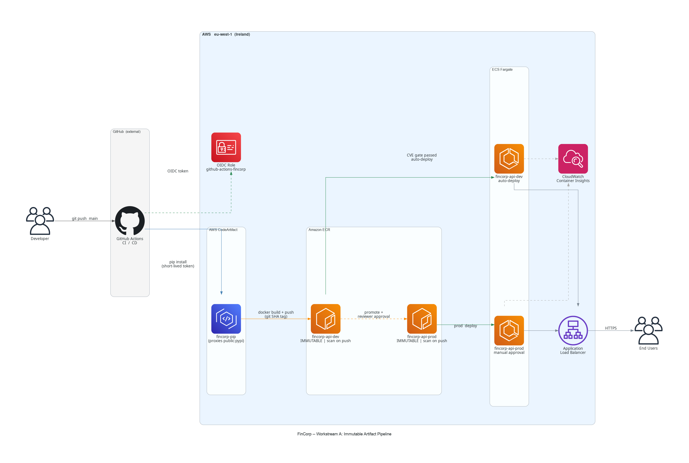

**Key security properties enforced by the pipeline:**

- **OIDC authentication** — no long-lived AWS credentials stored in GitHub; the Actions runner exchanges a short-lived OIDC token for an IAM role scoped to `refs/heads/main`
- **CodeArtifact proxy** — all `pip install` calls during `docker build` route through the `fincorp-pip` domain, which proxies `public:pypi`; dependencies are auditable and cacheable
- **Tag immutability** — ECR repositories are configured with `image_tag_mutability = IMMUTABLE`; a pushed SHA tag cannot be overwritten by a later build
- **CVE gate** — CI waits for ECR's scan-on-push to complete, then fails the workflow on any `HIGH` or `CRITICAL` finding before any deployment step runs
- **Environment gating** — production deploys require a GitHub Environment reviewer approval; dev deploys are automatic on CI pass

---

### Workstream B — Cross-Region Disaster Recovery

AWS Backup runs a daily snapshot of the primary RDS instance and automatically copies each recovery point to the DR vault in eu-central-1 via a `copy_action` rule. In a failure scenario, a single `aws backup start-restore-job` command against the DR vault restores the database with an RTO target of under 30 minutes.

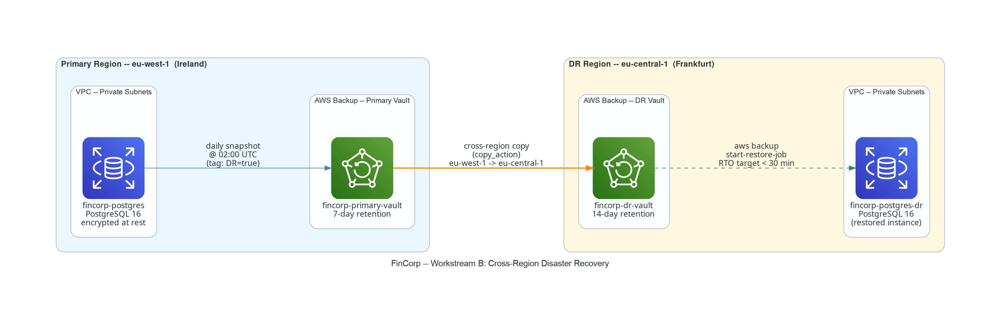

**Key DR properties:**

- **Primary vault** — `fincorp-primary-vault` (eu-west-1), 7-day retention, daily backup at 02:00 UTC
- **DR vault** — `fincorp-dr-vault` (eu-central-1), 14-day retention, auto-populated via `copy_action`
- **RTO target** — < 30 minutes from deletion to restored instance `available`
- **No RDS native backups** — AWS Backup is the single backup mechanism; native RDS automated backups are disabled to avoid double-billing; `deletion_protection = false` on the primary instance to allow DR simulation

The step-by-step simulation procedure is in [docs/dr-runbook.md](docs/dr-runbook.md).

---

## Repository Structure

```
.
├── app/
│   ├── main.py             # FastAPI application
│   ├── requirements.txt    # Pinned Python dependencies
│   └── Dockerfile          # Multi-stage, non-root, no baked credentials
├── terraform/
│   ├── main.tf             # Root orchestrator
│   ├── variables.tf
│   ├── outputs.tf
│   ├── backend.tf          # S3 state with native locking
│   ├── providers.tf        # eu-west-1 primary + eu-central-1 DR alias
│   └── modules/
│       ├── ecr/            # Two immutable ECR repos (dev + prod)
│       ├── ecs/            # Fargate cluster, ALB, task definition, service
│       ├── codeartifact/   # pip proxy (fincorp domain → pypi-store upstream)
│       ├── iam/            # OIDC provider, GitHub Actions role, ECS task roles
│       ├── vpc/            # VPC, subnets, security groups
│       ├── rds/            # PostgreSQL 16 (eu-west-1, encrypted at rest)
│       └── backup/         # AWS Backup plan + cross-region copy action
├── .github/
│   └── workflows/
│       ├── ci.yml          # Build · CVE gate · Push to ECR
│       └── deploy.yml      # Dev auto-deploy + prod manual approval gate
├── docs/
│   ├── dr-runbook.md           # Step-by-step DR simulation runbook
│   ├── fincorp_pipeline.png    # Workstream A architecture diagram
│   ├── fincorp_dr.png          # Workstream B architecture diagram
│   └── screenshots/            # Console evidence (CVE gate + DR failover walkthrough)
├── diagram-engine-room/
│   └── main.py             # Python diagrams source (regenerates docs/*.png)
├── bootstrap.sh            # One-time S3 state bucket creation
└── IMPLEMENTATION_PLAN.md  # Full task breakdown and agent assignment plan
```

---

## Prerequisites

| Tool | Minimum Version | Purpose |
|---|---|---|
| AWS CLI | 2.x | Infrastructure operations and DR simulation |
| Terraform | >= 1.10 | `use_lockfile = true` requires this version |
| Docker | 24.x | Local image builds and smoke tests |
| `jq` | 1.6+ | JSON parsing in runbook shell commands |

AWS credentials must have permissions to create IAM roles, S3 buckets, ECR repositories, ECS clusters, RDS instances, CodeArtifact domains, and AWS Backup plans.

---

## Setup

### 1 — Bootstrap Terraform state

Run once before `terraform init` to create the S3 state bucket with SSE-S3 encryption:

```bash
export AWS_REGION=eu-west-1
./bootstrap.sh
```

The script prints the bucket name. Update `terraform/backend.tf`:

```hcl
bucket = "fincorp-tfstate-<your-account-id>"
```

### 2 — Configure GitHub repository

In your GitHub repository settings, create:

1. **Secret** `AWS_ROLE_ARN` — the ARN of the `github-actions-fincorp` IAM role (output of Terraform, available after step 3)
2. **Environment** `production` — add yourself as a required reviewer

### 3 — Deploy infrastructure

```bash
cd terraform
terraform init
terraform apply \
  -var="github_org=<your-org>" \
  -var="github_repo=<your-repo>" \
  -var="tf_state_bucket_name=fincorp-tfstate-<account-id>" \
  -var="db_password=<strong-password>"
```

After apply, copy `github_actions_role_arn` from the outputs into the GitHub secret `AWS_ROLE_ARN`:

```bash
terraform output github_actions_role_arn
```

---

## Workstream A — How It Works

### Pipeline flow

1. **Push to `main`** triggers `ci.yml`
2. **CI** assumes the OIDC IAM role, fetches a 12-hour CodeArtifact pip token, and runs `docker build` with `PIP_INDEX_URL` set to the CodeArtifact proxy URL — pip dependencies never touch public PyPI directly
3. The image is pushed to `fincorp-api-dev` ECR with tag = git SHA; ECR scan-on-push runs immediately
4. `aws ecr wait image-scan-complete` blocks until the scan finishes; the workflow then inspects findings and **fails on any HIGH or CRITICAL CVE**
5. On pass, `deploy.yml` updates the ECS task definition and waits for service stability — automatic for dev, reviewer-gated for prod

### Local smoke test

```bash
cd app
docker build --build-arg APP_VERSION=local-test -t fincorp-api:test .
docker run --rm -p 8080:8080 -e APP_VERSION=local-test fincorp-api:test
```

```bash
curl http://localhost:8080/
# {"status":"success","message":"FinCorp API is running"}

curl http://localhost:8080/healthz
# {"status":"healthy","version":"local-test"}
```

> Local builds bypass CodeArtifact (no `PIP_INDEX_URL` build-arg is set). CI builds always route through CodeArtifact.

### CVE gate verification

To confirm the gate blocks vulnerable images:

1. Change the base image in `app/Dockerfile` to an older version (e.g. `python:3.8-slim`)
2. Push to a test branch
3. Observe the CI workflow fail at the **CVE gate** step with a list of findings
4. Revert the base image change

The screenshot below shows the gate in action: every step up to and including the image scan succeeds, then the **CVE gate** step fails the run because ECR reported `1 CRITICAL` and `3 HIGH` findings — the vulnerable image is blocked before it can ever be deployed.

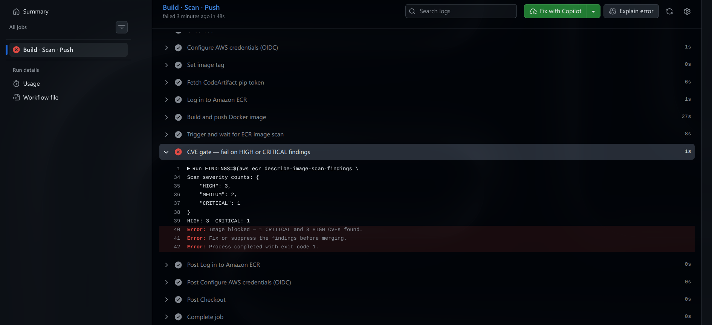

> A failed run here is the control working as designed — not a pipeline bug. The image is rejected at the gate, so no HIGH/CRITICAL vulnerability reaches ECS.

---

## Workstream B — How It Works

### Normal state verification

```bash
# Confirm RDS is running in eu-west-1
aws rds describe-db-instances \
  --db-instance-identifier fincorp-postgres \
  --region eu-west-1 \
  --query 'DBInstances[0].{Status:DBInstanceStatus,Engine:Engine,Version:EngineVersion}' \
  --output table

# Confirm backups are replicating to eu-central-1
aws backup list-recovery-points-by-backup-vault \
  --backup-vault-name fincorp-dr-vault \
  --region eu-central-1 \
  --query 'RecoveryPoints[*].{Status:Status,Created:CreationDate}' \
  --output table
```

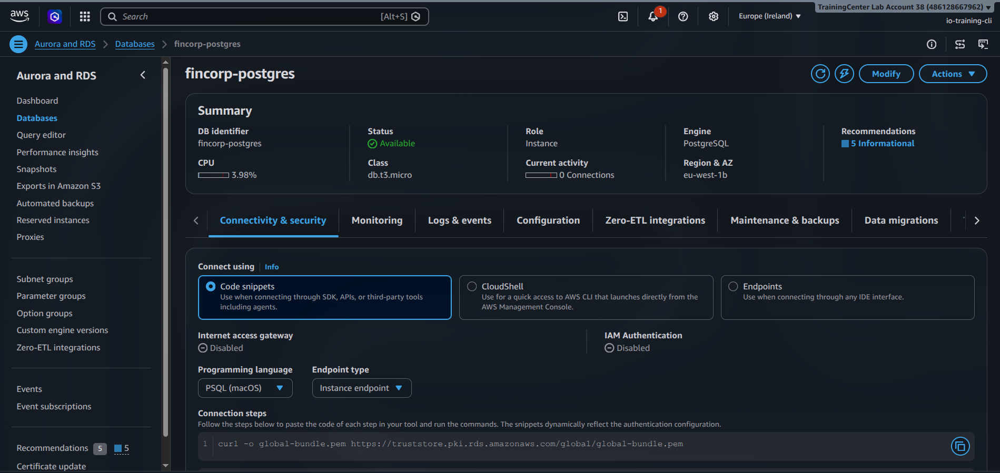
*Normal state — the primary `fincorp-postgres` running and `Available` in eu-west-1 (Ireland).*

### DR simulation

The full step-by-step procedure is in [docs/dr-runbook.md](docs/dr-runbook.md). The walkthrough below shows an actual end-to-end failover, captured from the AWS console.

**1 — Back up the primary.** An on-demand backup of `fincorp-postgres` completes in `fincorp-primary-vault` (eu-west-1).

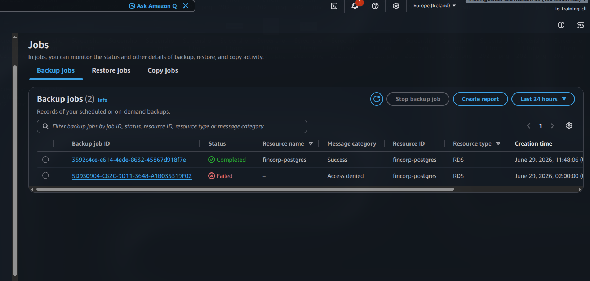
*The on-demand backup succeeds (11:48). The earlier `02:00` row failed with **Access denied** — the scheduled run before the AWS Backup service role was corrected (see the note at the end of this section).*

**2 — Replicate to the DR region.** The recovery point is copied from `fincorp-primary-vault` (eu-west-1) to `fincorp-dr-vault` (eu-central-1).

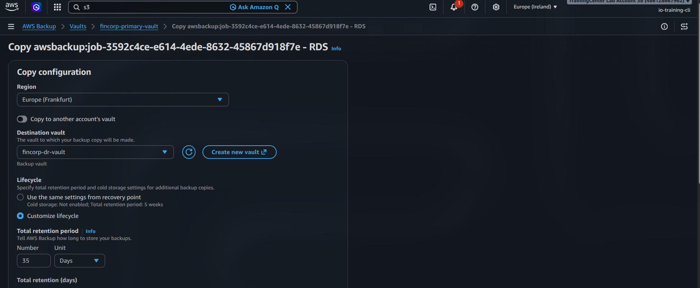
*Initiating the cross-region copy of the recovery point to `fincorp-dr-vault` in Frankfurt.*

**3 — Confirm the copy landed in Frankfurt.** The replicated recovery point now appears in the DR vault — independent of the primary region.

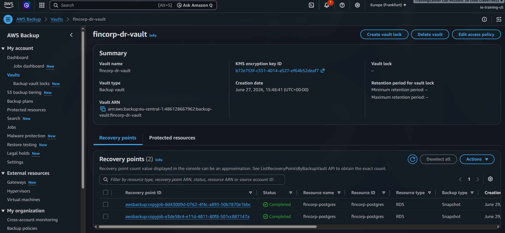
*The recovery point present in `fincorp-dr-vault` (eu-central-1) — proof the backup survives a primary-region loss.*

**4 — Simulate region failure.** The primary `fincorp-postgres` is deleted in eu-west-1. This marks the start of the RTO clock.

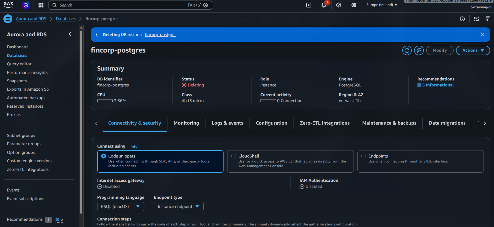
*The primary instance enters `Deleting` in Ireland — the "region failure" event.*

**5 — Restore from the DR vault.** In eu-central-1, the replicated recovery point is selected and a restore is launched as `fincorp-postgres-dr`.

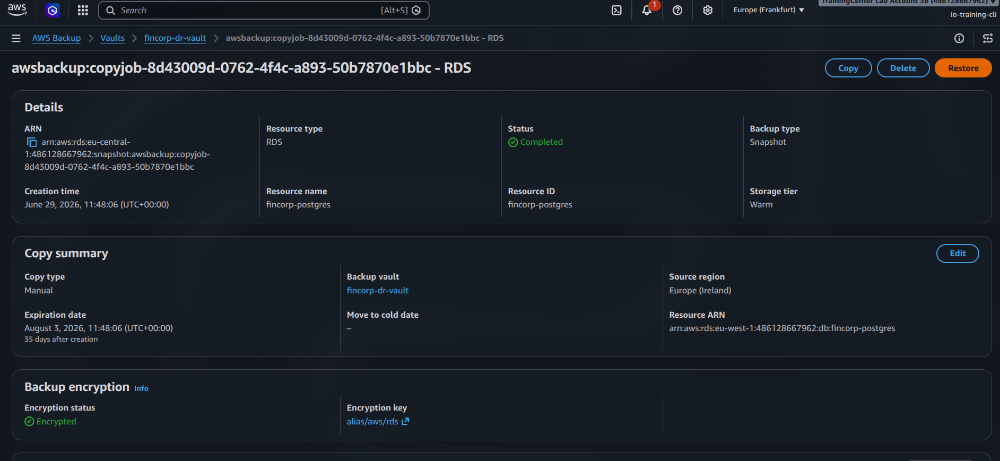
*Restoring the replicated recovery point from `fincorp-dr-vault` in Frankfurt.*

**6 — Restore job runs in Frankfurt.** AWS Backup provisions the new instance from the recovery point.

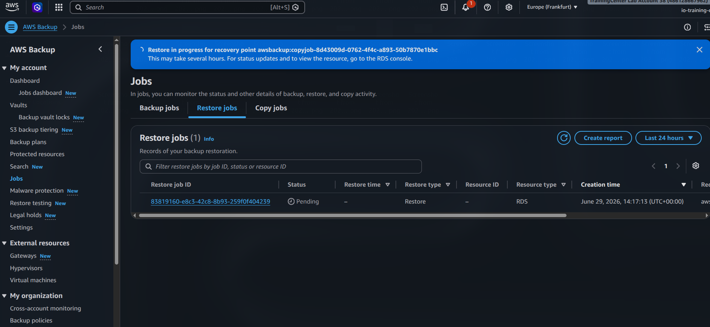
*The restore job runs in eu-central-1, provisioning `fincorp-postgres-dr`.*

**7 — DR instance available.** The restored database comes up healthy in the DR region:

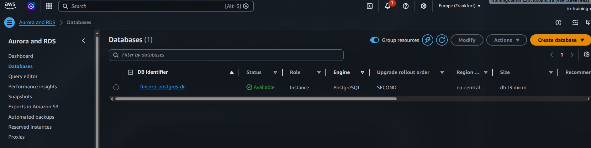
*`fincorp-postgres-dr` `Available` in eu-central-1 (Frankfurt) — the workload recovered into the DR region after the Ireland primary was destroyed.*

```text
$ aws rds describe-db-instances --db-instance-identifier fincorp-postgres-dr --region eu-central-1
Class    : db.t3.micro
Endpoint : fincorp-postgres-dr.c1s8k4yiin4y.eu-central-1.rds.amazonaws.com
Engine   : postgres
Version  : 16.13
Status   : available
```

**RTO result:** restore initiated `14:17 UTC` → `fincorp-postgres-dr` reached `available` minutes later — **comfortably within the < 30 minute target**. Because the recovery point was already replicated to Frankfurt, the restore is the only time-critical path.

> **Note — on-demand vs scheduled copy.** The plan's `copy_action` replicates **scheduled** backups to the DR vault automatically. This walkthrough used an **on-demand** backup, which does not inherit the plan's copy rule, so the cross-region copy (step 2) was triggered manually. The automated daily backup needs no manual copy step.
>
> **Note — AWS Backup service role.** The first scheduled run failed with *Access denied* because the `AWSBackupDefaultServiceRole` was absent, then mis-pathed, then missing its policy attachments. The role is now defined in Terraform (`modules/iam`) at `/service-role/` with both `AWSBackupServiceRolePolicyFor{Backup,Restores}` attached, so backups and restores succeed unattended.

**Target RTO: < 30 minutes** from instance deletion to restored instance `available`.

---

## Security Design

| Control | Implementation |
|---|---|
| No long-lived credentials | GitHub Actions uses OIDC; trust policy scoped to repo + `refs/heads/main` |
| Immutable artifacts | `image_tag_mutability = IMMUTABLE` on both ECR repositories |
| Vulnerability gate | HIGH/CRITICAL CVEs block all deployments; scan runs automatically on every push |
| Dependency auditing | All pip installs proxied through CodeArtifact; no direct PyPI access at container runtime |
| Encryption at rest | RDS storage encrypted with AWS-managed keys; Terraform state encrypted via SSE-S3 |
| Principle of least privilege | ECS task roles scoped to their service; GitHub Actions role scoped to ECR, ECS, and CodeArtifact only |
| DR data integrity | Cross-region copy is automated via Backup plan `copy_action`; no manual steps required for replication |
